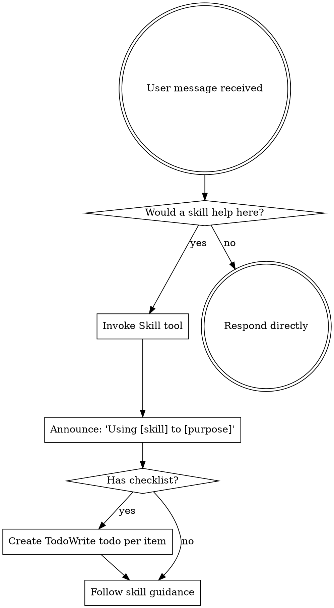

# Using Skills

Skills are proven workflows that help with specific tasks. Use them when they add value.

## When to Use Skills

**Good candidates for skills:**
- Complex multi-step tasks (brainstorming, debugging, TDD)
- Tasks where you've made mistakes before
- Workflows that benefit from structure

**Skip skills for:**
- Simple, single-step tasks
- Quick questions or clarifications
- Tasks where the overhead outweighs the benefit

## How to Access Skills

**In Claude Code:** Use the `Skill` tool. When you invoke a skill, its content is loaded and presented to you—follow it directly. Never use the Read tool on skill files.

**In other environments:** Check your platform's documentation for how skills are loaded.

## Skill Usage Flow

## Skill Priority

When multiple skills could apply:

1. **Process skills first** (brainstorming, debugging) - determine HOW to approach
2. **Implementation skills second** - guide execution

## Skill Types

**Rigid** (TDD, debugging): Follow the discipline. These exist because shortcuts cause problems.

**Flexible** (patterns): Adapt principles to context.

The skill itself indicates which type it is.

## Available Skills

| Skill | Use When |
|-------|----------|
| brainstorming | Starting new features, refining ideas |
| writing-plans | Breaking down complex implementations |
| executing-plans | Working through a written plan |
| test-driven-development | Writing new functionality |
| systematic-debugging | Investigating bugs or failures |
| verification-before-completion | Before claiming something is fixed |
| requesting-code-review | Reviewing completed work |
| receiving-code-review | Responding to feedback |
| using-git-worktrees | Need isolated workspace |
| finishing-a-development-branch | Completing feature work |

## User Instructions

Instructions describe WHAT to do. Skills help with HOW. Use your judgment on when the structure helps vs. when it's overhead.
